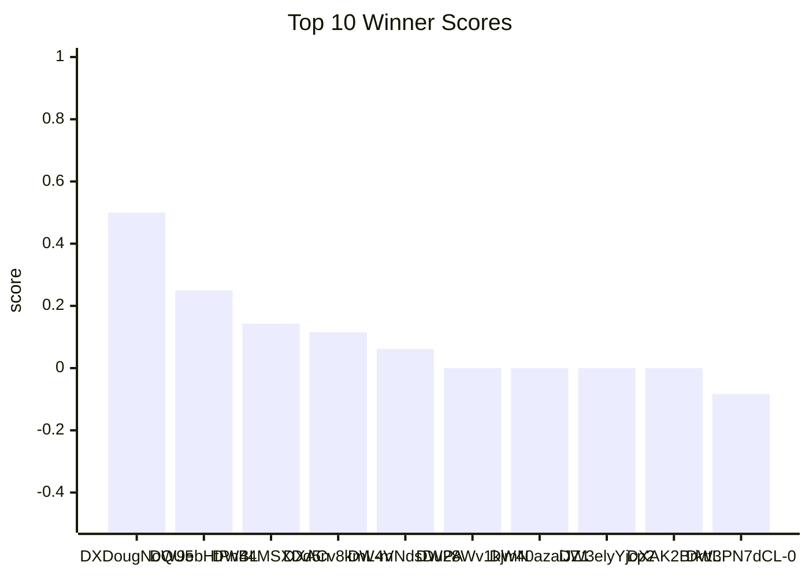

# Winner Score Graph

Scale: winner_score ranges from -0.5 (worst) to 1.0 (best).

## Top 15 (min 5 labeled rows)

- reel/DXDougNoQU5/ | 0.500 | ################--------
- reel/DW9ebHtPnBL/ | 0.250 | ############------------
- p/DW44MSXDd5n/ | 0.143 | ##########--------------
- reel/DXACv8kmL-m/ | 0.115 | ##########--------------
- reel/DW4VNdsDuPA/ | 0.062 | #########---------------
- reel/DW28Wv1kjmN/ | 0.000 | ########----------------
- reel/DW40azaiJZ1/ | 0.000 | ########----------------
- reel/DW3elyYjcp2/ | 0.000 | ########----------------
- reel/DXAK2BrkttL/ | 0.000 | ########----------------
- reel/DW3PN7dCL-0/ | -0.083 | #######-----------------
- reel/DW9SgHhuO6i/ | -0.144 | ######------------------
- reel/DW_x3ZrO2Wz/ | -0.152 | ######------------------
- reel/DW4F2bDCLLd/ | -0.159 | #####-------------------
- reel/DW20px2kiNY/ | -0.269 | ####--------------------
- reel/DXAkYV4DpiT/ | -0.269 | ####--------------------

## Bottom 15 (min 5 labeled rows)

- reel/DW6w4h1j08o/ | -0.500 | ------------------------
- reel/DW3hkdljRnT/ | -0.500 | ------------------------
- reel/DW9ZM2xki_o/ | -0.438 | #-----------------------
- reel/DW34A7uCOwb/ | -0.406 | ##----------------------
- reel/DXCSL_Xjuxm/ | -0.300 | ###---------------------
- reel/DXAkYV4DpiT/ | -0.269 | ####--------------------
- reel/DW20px2kiNY/ | -0.269 | ####--------------------
- reel/DW4F2bDCLLd/ | -0.159 | #####-------------------
- reel/DW_x3ZrO2Wz/ | -0.152 | ######------------------
- reel/DW9SgHhuO6i/ | -0.144 | ######------------------
- reel/DW3PN7dCL-0/ | -0.083 | #######-----------------
- reel/DXAK2BrkttL/ | 0.000 | ########----------------
- reel/DW3elyYjcp2/ | 0.000 | ########----------------
- reel/DW40azaiJZ1/ | 0.000 | ########----------------
- reel/DW28Wv1kjmN/ | 0.000 | ########----------------

## Mermaid (Top 10)

